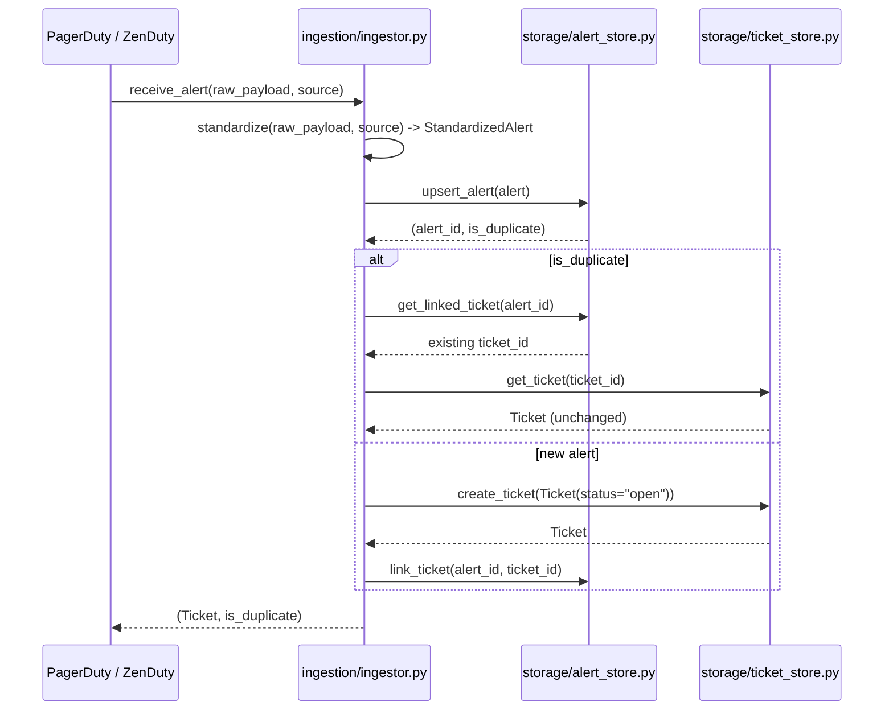
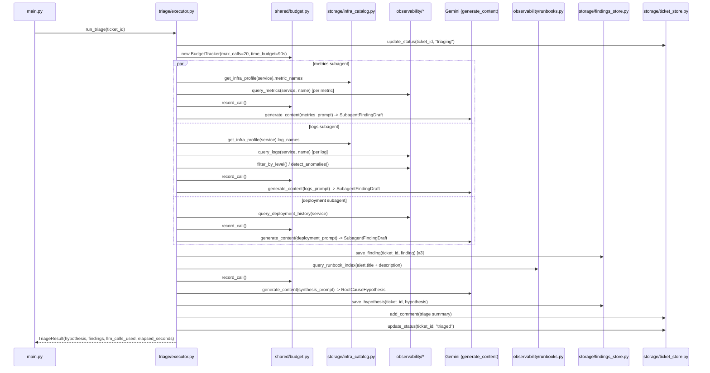
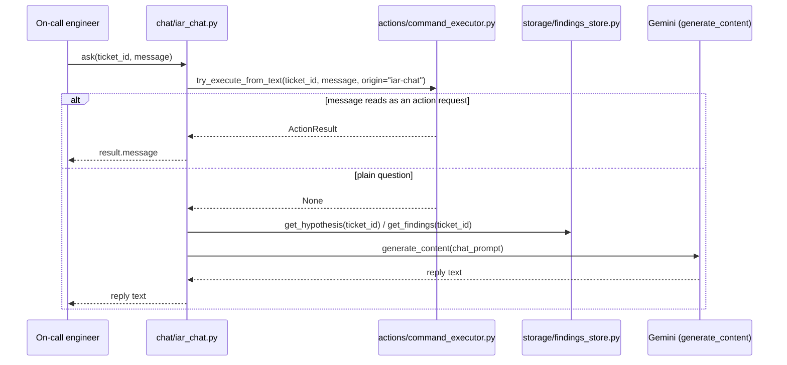

# IncidentAutoRemediationAgent — Incident Auto-Remediation Prototype

A runnable prototype of an incident auto-remediation system, similar in
shape to incident.io: alerts come in from monitoring tools, get triaged by
an LLM-driven executor that reasons about metrics/logs/deployment history in
parallel, posts a root-cause hypothesis back onto the ticket, and then waits
for a human — either by tagging the agent in a ticket comment or by asking
in a chat interface — before it changes anything in the underlying infra.

The system **augments the on-call engineer, it does not replace them**:
there is no code path where an action fires without an explicit human
instruction. Two entry points converge on the same Command Executor: a
ticket comment starting with `@agent`, or a direct request in the IAR
(Incident Auto-Remediation) chat.

## Infra substitutions

No external services are installed. Each production component is swapped
for a lightweight substitute with a comparable API:

| Production component | Substitute | Where |
|---|---|---|
| PagerDuty / ZenDuty webhooks | Synthetic alert payloads | `scenarios.py` |
| PostgreSQL (alert store) | SQLite | `storage/alert_store.py` |
| Jira / ticket system | SQLite (tickets + comments) | `storage/ticket_store.py` |
| CMDB / infra metadata | Static in-memory catalog | `storage/infra_catalog.py` |
| K8s / AWS / feature-flag service | Mutable JSON file | `storage/infra_state.py` |
| Datadog / Prometheus (metrics) | Synthetic seeded time series | `observability/metrics.py` |
| ELK / Splunk (logs) | Synthetic seeded log lines | `observability/logs.py` |
| CI/CD deployment history | Synthetic seeded deploy records | `observability/deployments.py` |
| Runbook vector index | Keyword-overlap search | `observability/runbooks.py` |
| MCP tools (modify-infra, deploy-service, update-database) | Plain Python functions | `actions/mcp_tools.py` |
| Alert/event queue | In-process function call | `ingestion/ingestor.py` |
| Findings store (raw executor output) | SQLite | `storage/findings_store.py` |

## Directory layout

```
systems/IncidentAutoRemediationAgent/
    main.py                    # end-to-end demo: alerts -> tickets -> triage -> chat -> action
    scenarios.py                # 3 synthetic incidents + seeded observability data
    test_deterministic.py       # budget cap, dedupe, tag-parsing, mcp_tools -- no live API calls
    README.md

    common/
        gemini_client.py          # local Gemini client wrapper, no outside dependency

    shared/                     # cross-cutting, no dependency on the other folders
        models.py                  # every Pydantic schema
        budget.py                   # BudgetTracker -- the 20-call / 90s triage ceiling

    ingestion/                  # Day-0 design: the write path for alerts
        ingestor.py                # receive_alert(): standardize -> dedupe/upsert -> create ticket

    storage/                    # the Postgres / Jira / CMDB / K8s substitutes
        alert_store.py             # SQLite: alerts, dedup/upsert by fingerprint
        ticket_store.py             # SQLite: tickets + comments, "@agent" tag detection
        findings_store.py            # SQLite: raw subagent findings + root-cause hypothesis
        infra_catalog.py              # static: service -> log/metric names, deps, dbs, ASGs
        infra_state.py                 # mutable: replica counts, deployed version, feature flags, db pool size

    observability/               # the Datadog / ELK / CI/CD / runbook-index substitutes
        metrics.py                    # query.metrics
        logs.py                        # query.logs + filter_by_level() + detect_anomalies() "scripts"
        deployments.py                  # query.deployment_history
        runbooks.py                      # query.runbook.index (keyword search)

    triage/                      # the Executor
        executor.py                     # run_triage(): parallel subagents under budget, synthesis, persist+post
        subagents.py                     # metrics_subagent / logs_subagent / deployment_subagent
        prompts.py                        # subagent + synthesis prompt builders

    chat/                        # IAR chat
        iar_chat.py                     # ask(): action-request check, then Q&A over incident context
        prompts.py

    actions/                     # Command Executor (human-gated)
        mcp_tools.py                     # modify_infra / deploy_service / update_database
        command_executor.py               # NL -> ActionRequest -> dispatch, from either trigger
        prompts.py                         # NL -> structured ActionRequest extraction prompt

    data/                        # created at runtime: *.db, infra_state.json (gitignored)
```


## Answering the open design questions

1. **Augment, not replace.** `actions/command_executor.py` only ever runs
   from an explicit human trigger (an `@agent` ticket comment or a chat
   request) — there is no autonomous action path.
2. **Day-0 design** is `ingestion/ingestor.py`: standardize whatever shape a
   source sends, dedupe/upsert by a `(service, title)` fingerprint, open one
   ticket per genuinely new alert.
3. **LLM-call ceiling**: 5000 alerts/day steady state, 90s p99
   time-to-first-action, ~20s/call, 5 calls running in parallel ⇒ 4 rounds ×
   5 = a 20-call budget per triage, enforced by `shared/budget.py`'s
   `BudgetTracker`. In practice each triage only needs ~4 calls (3 subagents
   + 1 synthesis) — see [Known simplifications](#known-simplifications) for
   why, and how a more agentic subagent could use the rest of the budget.
4. **Where the executor shares findings**: raw findings go to
   `storage/findings_store.py`; a synthesized, human-readable summary is
   posted as a ticket comment.
5. **What the executor can access, and how it knows**: `storage/infra_catalog.py`
   maps each service to the specific log/metric names, dependent services,
   databases, and autoscaling groups it has — the executor looks a service
   up here first, rather than guessing across "many log streams, many
   metric names, etc."
6/7. **Executor flow and subagent roles**: see the triage sequence diagram
   below — 3 subagents (metrics, logs, deployment) run in parallel, each
   backed by a "script" (`filter_by_level` / `detect_anomalies` for logs),
   plus a keyword-based runbook lookup, synthesized into one hypothesis.
8. **What the on-call engineer gets**: the IAR chat (`chat/iar_chat.py`),
   scoped to one incident and backed by its findings and hypothesis.
9. **After the executor is done**: a summary comment on the ticket, raw
   findings persisted, and the system waits for a human before acting.
10. **An easy way to execute commands**: `actions/mcp_tools.py` — three
    plain Python functions acting on the `infra_state` substitute.

## Ingestion flow — alert to ticket



## Triage flow — the Executor



## IAR chat



## Command Executor — two triggers, one dispatcher

```mermaid
sequenceDiagram
    participant Engineer as On-call engineer
    participant Tickets as storage/ticket_store.py
    participant CmdExec as actions/command_executor.py
    participant Gemini as Gemini (generate_content)
    participant Tools as actions/mcp_tools.py
    participant State as storage/infra_state.py

    alt tag-triggered
        Engineer->>Tickets: add_comment("@agent rollback the last deploy")
        Tickets->>CmdExec: process_ticket_comment(ticket_id, comment)
        CmdExec->>Tickets: extract_tagged_instruction(comment.text)
    else chat-triggered
        Engineer->>CmdExec: try_execute_from_text(ticket_id, chat_message)
    end

    CmdExec->>Gemini: generate_content(action_extraction_prompt) -> ActionRequest
    alt Unrecognized action
        CmdExec-->>Engineer: None (chat falls through to Q&A; tag comment is left alone)
    else Recognized action
        CmdExec-->>Engineer: Execute recognized action
        CmdExec->>Tools: dispatch(request)
        Tools->>State: get_resource(service) / update_resource(...) / set_feature_flag(...)
        State-->>Tools: before / after state
        Tools-->>CmdExec: ActionResult(success, message, before, after)
        CmdExec->>Tickets: add_comment(action outcome)
        CmdExec-->>Engineer: ActionResult
    end
```

## Running it

```bash
cd systems/IncidentAutoRemediationAgent
pip install -r requirements.txt
cp .env.example .env    # then fill in GEMINI_API_KEY

python main.py                    # end-to-end demo: 3 incidents, triage, chat, 2 action demos
python test_deterministic.py      # budget/dedupe/tag/mcp_tools checks, no API key needed
```

`main.py` makes real calls to the Gemini API (no embeddings needed here,
just `generate_content` with structured output). It seeds `data/` on every
run; delete `data/` for a completely clean run, since alerts dedupe by a
stable `(service, title)` fingerprint across runs.

## Known simplifications

1. **Single-process, single JSON file for infra_state** 
2. **Subagents are single-shot summarizers, not a ReAct loop** — each makes
   exactly one LLM call over pre-fetched data, rather than iteratively
   deciding what to query. A full triage uses ~4 of the 20-call budget as a
   result; `BudgetTracker` still enforces the ceiling for real, it's just
   rarely approached at this scale. A more agentic subagent that queries,
   re-reads, and re-queries would be a natural extension that spends more
   of the remaining budget.
3. **The 90s p99 time-to-first-action target is measured, not enforced** —
   `main.py` prints elapsed time against the target; nothing aborts a
   live Gemini call mid-flight if it's exceeded.
4. **No real message queue/broker** between ingestion and triage — a
   direct function call substitutes for the alert/event stream in diagram 2.
5. **IAR chat always calls the Command Executor's action-extraction step
   first**, on every message, to check whether it reads as an action
   request. This costs one extra LLM call per chat turn even for pure
   questions — a cheaper keyword pre-filter would avoid that, but was left
   out in favor of a single, correct parsing path shared with the
   tag-triggered route.
6. **Runbook search is keyword overlap**, not a vector index — a handful of
   hand-authored runbooks don't need one, and it keeps this lookup off the
   LLM-call budget entirely.
7. **No retry/backoff around Gemini calls, and no auth/audit trail on
   actions** — every action is logged as a ticket comment, but there's no
   access-control check on who's allowed to type `@agent rollback ...`.
8. **5000 alerts/day / 90s p99 are the production targets this design is
   for** — the 3-scenario demo proves the mechanisms (dedup, parallel
   triage under a call budget, human-gated actions from two entry points)
   work, not that they hold at that volume.
